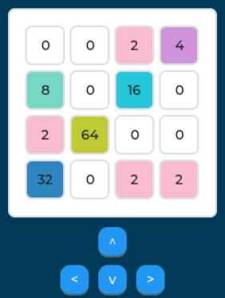

# 2048_game_micropython

A version of the game [2048](https://en.wikipedia.org/wiki/2048_(video_game)) in Micropython, specially design to run in Microcontrollers.

Made as final project of the discipline of Realtime Computing, as it applies concepts of Real-Time Operating Systems.

### Contributions

[Pietro Cardoso](https://github.com/Pietro19) and [Pedro Piccichelli](https://github.com/Piccichelli) are contributers of this repository.
