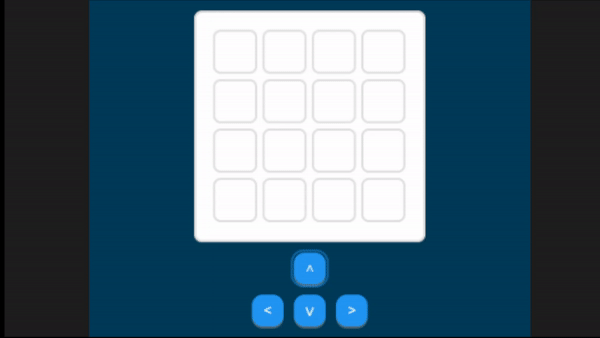

# 2048_game_micropython

A version of the game [2048](https://en.wikipedia.org/wiki/2048_(video_game)) in Micropython, specially design to run in Microcontrollers.

Made as final project of the discipline of Realtime Computing, as it applies concepts of Real-Time Operating Systems.



## Prerequisites:
- A STM32 board with [pyRTOS](https://github.com/Rybec/pyRTOS) installed.

## Setup Instructions:
1. Download this repository.
2. Open the Anaconda terminal.
3. Navigate to the downloaded repository directory.
4. Connect the STM32 board to your computer via USB.
5. Mount the board using the following command:
```
mpremote mount .
```
6. Import the `game_rtos` module by entering the following command:
```python
import game_rtos
```
7. Execute the `game_rtos.main()` function to start the application:
```python
game_rtos.main()
```
### Contributions

[Pietro Cardoso](https://github.com/Pietro19) and [Pedro Piccichelli](https://github.com/Piccichelli) are also contributers of this repository.
Make sure to follow these instructions in order to run the application successfully.
